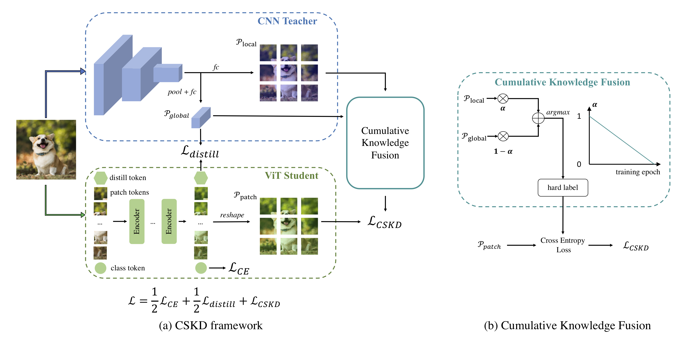

This repo is the official implementation of the ICCV-2023 paper: [Cumulative Spatial Knowledge Distillation for Vision Transformers](https://arxiv.org/abs/2307.08500).


# Cumulative Spatial Knowledge Distillation

## Framework

<div style="text-align:center"></div>

## Main Results

|  |  |
|:---------------:|:-----------------:|
| DeiT-Ti | 74.5 |
| **CSKD-Ti** | **76.3** |
| DeiT-S | 81.2 |
| **CSKD-S** | **82.3** |
| DeiT-B | 83.4 |
| **CSKD-B** | **83.8** |


# Installation

Environments:

- Python 3.6
- PyTorch 1.10.1
- torchvision 0.11.2

Install the package:

```
sudo pip3 install -r requirements.txt
```

# Getting started

- Download the dataset at <https://image-net.org/> and put them to `./data/imagenet`

## Evaluate

```bash
python3 -m torch.distributed.launch --use_env --standalone --nnodes 1 --nproc_per_node 2 main.py --config configs/cskd_tiny.py --eval-only --ckpt {ckpt}
```

## Train

```bash
python3 -m torch.distributed.launch --use_env --standalone --nnodes 1 --nproc_per_node 8 main.py --config configs/cskd_tiny.py
```


# Citation

If this repo is helpful for your research, please consider citing the paper:

```BibTeX
@inproceedings{zhao2023cumulative,
  title={Cumulative Spatial Knowledge Distillation for Vision Transformers},
  author={Zhao, Borui and Song, Renjie and Liang, Jiajun},
  booktitle={Proceedings of the IEEE/CVF International Conference on Computer Vision},
  pages={6146--6155},
  year={2023}
}
```

# License

This repo is released under the MIT license. See [LICENSE](LICENSE) for details.

# Acknowledgement

- Thanks for DeiT. We build this repo based on [DeiT](https://github.com/facebookresearch/deit).
